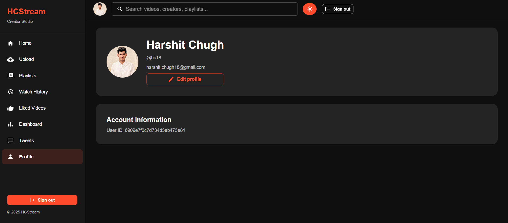
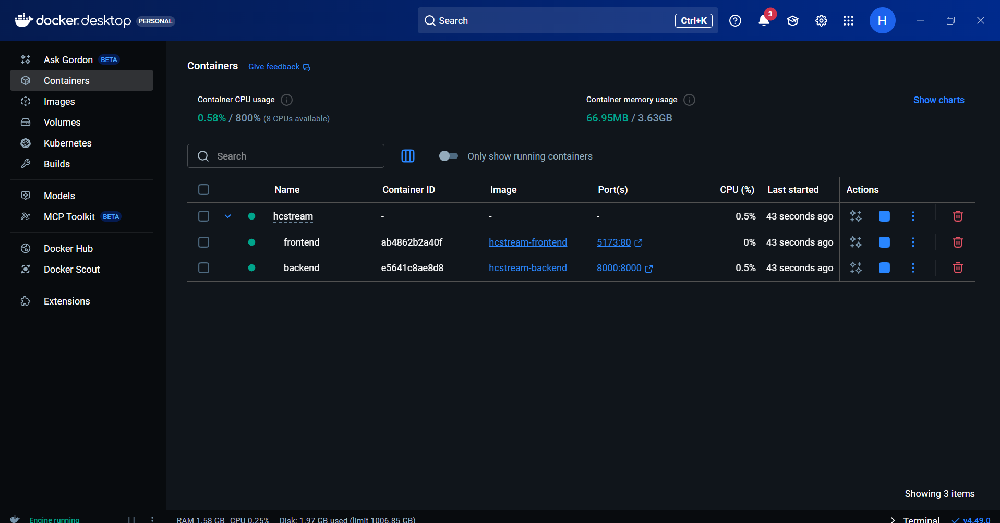
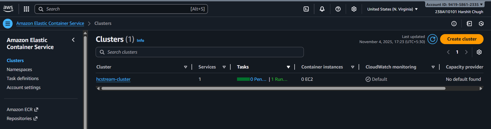
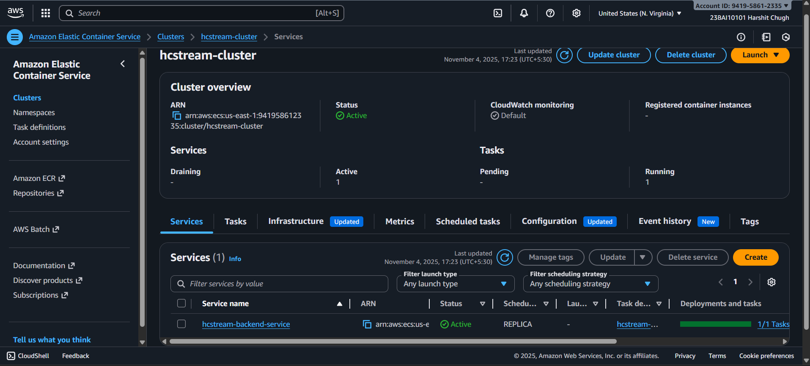
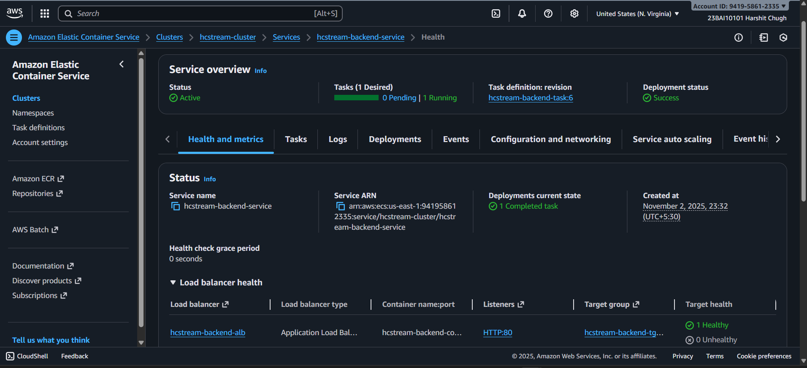
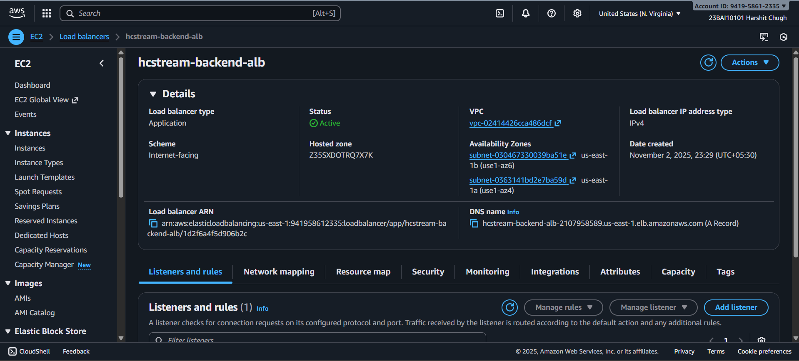
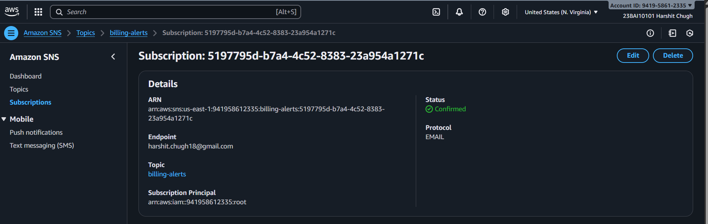

# 🎥 HCStream – AI-Powered Full Stack Media Streaming Platform

**HCStream** is a cloud-deployed, full-stack media streaming web app built with **React**, **Node.js**, and **MongoDB**, powered by **Docker** and deployed via **AWS ECS (Fargate)**.  
It allows users to upload, manage, and stream media files, and integrates a smart AI Caption & Transcript Generator to enhance accessibility and user experience.
> 💡 *Built as a full-stack + AI + Cloud project showcasing scalable modern web architecture.*

---

## 🚀 Overview

HCStream brings together modern full-stack development, AI integration, and cloud deployment in one platform.  
It demonstrates how scalable web applications can be built using containerized microservices and deployed seamlessly through AWS.

---

## 🧱 Tech Stack

| Layer | Technology |
|-------|-------------|
| **Frontend** | React (Vite), Axios, Tailwind CSS |
| **Backend** | Node.js, Express.js |
| **Database** | MongoDB (Mongoose ODM) |
| **AI Module (upcoming)** | OpenAI Whisper / Hugging Face Transformers |
| **Containerization** | Docker |
| **CI/CD** | GitHub Actions |
| **Cloud Deployment** | AWS ECS (Fargate), AWS S3, AWS Application Load Balancer (ALB) |
| **Version Control** | Git + GitHub |

---

## 🧩 Core Features

- 🎬 **Media Upload & Playback** – Upload, store, and stream videos from a clean, responsive UI.  
- 🔐 **Authentication System** – Secure login and registration (JWT planned for production).  
- 📡 **Cloud Deployment** – Backend and frontend deployed via **AWS ECS** and **S3**, connected through an **Application Load Balancer**.  
- 🐳 **Dockerized Architecture** – Each service containerized for better scalability.  
- ⚙️ **CI/CD Pipeline** – Automated builds and deployments using **GitHub Actions**.  
- 🧠 **AI Caption / Transcript Generator** *(upcoming)* – Automatically generate captions and transcripts for uploaded videos.  
- 📄 **Well-structured Documentation** – Clean code and organized setup for easy understanding.

---

## 🗂️ Project Structure

```bash
HCStream/
├── backend/
│   ├── src/
│   │   ├── controllers/
│   │   ├── db/
│   │   ├── middlewares/
│   │   ├── models/
│   │   ├── routes/
│   │   ├── utils/
│   │   ├── app.js
│   │   ├── constants.js
│   │   └── index.js
│   ├── Dockerfile
│   └── package.json
├── frontend/
│   ├── src/
│   ├── vite.config.js
│   ├── Dockerfile
│   └── package.json
├── .github/workflows/
│   └── deploy.yml
├── docker-compose.yml
└── README.md
```


---

## 🧠 AI Feature (Planned)

### AI Caption & Transcript Generator
- Uses **speech-to-text models** (OpenAI Whisper / Hugging Face Wav2Vec2).  
- Generates captions and transcripts automatically for uploaded videos.  
- Integrated as a backend REST endpoint with a simple frontend button/modal for users.

This addition will make HCStream a complete **Full Stack + AI + Cloud** application.

---

## ⚙️ Local Setup

### 1️⃣ Clone the Repository
```bash
git clone https://github.com/harshit18-09/HCStream.git
cd HCStream
```
### 2️⃣ Environment Variables

| **Component** | **Variable** | **Description** | **Example / Default** |
|----------------|--------------|-----------------|------------------------|
| **Backend** | `PORT` | Port on which the backend server runs | `5000` |
|  | `MONGO_URI` | MongoDB connection string | `your_mongodb_uri` |
|  | `JWT_SECRET` | Secret key for JWT authentication | `your_secret` |
| **Frontend** | `VITE_API_URL` | API base URL for frontend requests | `http://localhost:5000` |

> 💡 Create separate `.env` files in the backend and frontend folders with these variables.  
> Ensure `.env` is added to `.gitignore` to prevent pushing sensitive information.

---

## ☁️ AWS Deployment

### 🏗️ Architecture Overview
- **Backend:** Deployed on **AWS ECS (Fargate)** using Docker containers.  
- **Frontend:** Hosted on **AWS S3** as a static site.  
- **Load Balancer:** Managed via **AWS Application Load Balancer (ALB)** for routing traffic.  
- **CI/CD:** Automated through **GitHub Actions** for build and deployment.  

**Pipeline Flow:**  
`Local Development → Git Push → GitHub Actions → AWS ECS (Fargate)`

---

### 📸 Screenshots

| **Section** | **Preview** |
|--------------|-------------|
| 🖥️ **UI Preview** |  |
| 🧰 **Docker Setup** |  |
| ☁️ **AWS ECS - Cluster Overview** |  |
| ☁️ **AWS ECS - Running Tasks** |  |
| ☁️ **AWS ECS - Healthy Service** |  |
| 🌐 **AWS ALB (Load Balancer)** |  |
| ⚡ **GitHub Actions (CI/CD)** |  |
| 💸 **AWS SNS Billing Alert** |  |
| 🧠 **AI Module** *(coming soon)* | _To be added after AI Caption/Transcript integration_ |

> 🗂️ All screenshots are stored in `/docs/screenshots/` folder.


---

### 📘 Highlights
- Full-stack application built with **React (Vite)**, **Node.js**, **Express**, **MongoDB**, and **Docker**.  
- **Cloud-native deployment** leveraging AWS ECS (Fargate) and S3 hosting.  
- **Automated CI/CD pipeline** with GitHub Actions for seamless updates.  
- Structured, modular codebase ensuring scalability and maintainability.  
- Upcoming **AI Caption Generator** module for enhanced accessibility and interactivity.

---

### 🌱 Future Enhancements
- 🧠 Add **AI video summarization** feature.  
- 🎞️ Implement **smart media tagging**.  
- 📊 Build an **analytics dashboard** for media engagement.  
- 🚀 Migrate frontend to **Next.js** for better performance.

---

### 🧑‍💻 Author
**Harshit Chugh**  
B.Tech CSE (AI & ML), VIT Bhopal  

🔗 [LinkedIn](https://www.linkedin.com/in/harshit-chugh-719005294)  
💻 [GitHub](https://github.com/harshit18-09)

---

### ⭐ Acknowledgements
- [AWS ECS Documentation](https://docs.aws.amazon.com/ecs/)
- [Docker Docs](https://docs.docker.com/)
- [OpenAI Whisper](https://github.com/openai/whisper)

---

This project demonstrates end-to-end development — from frontend, backend, and database design to containerization, CI/CD, and cloud deployment.

---

### 🏁 License
This project is open-source and available under the **MIT License**.


